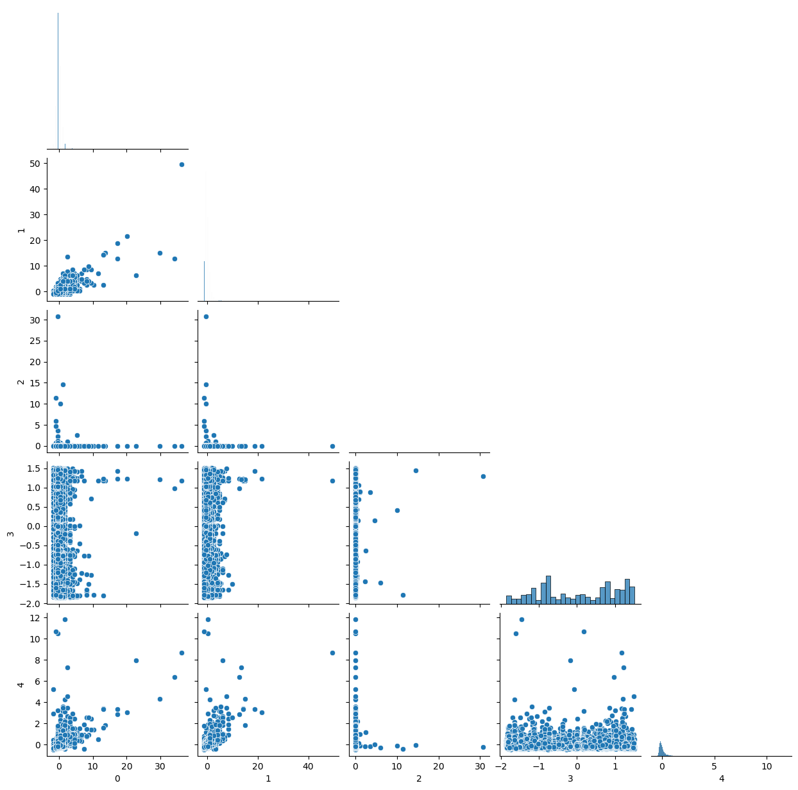
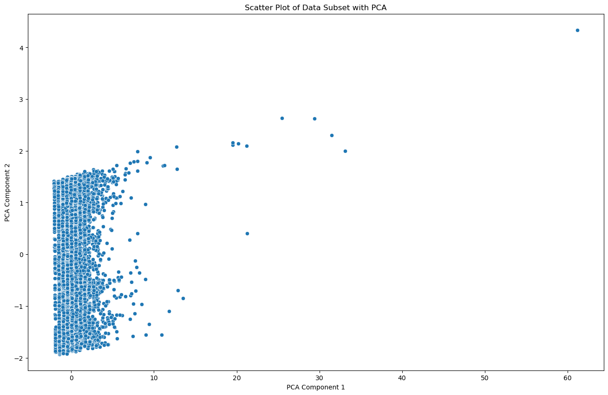
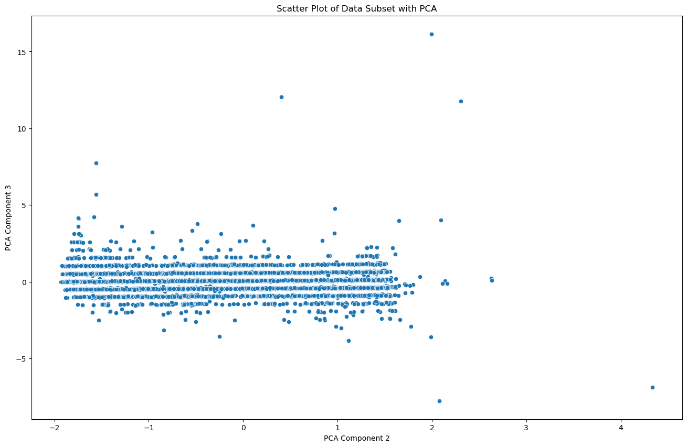
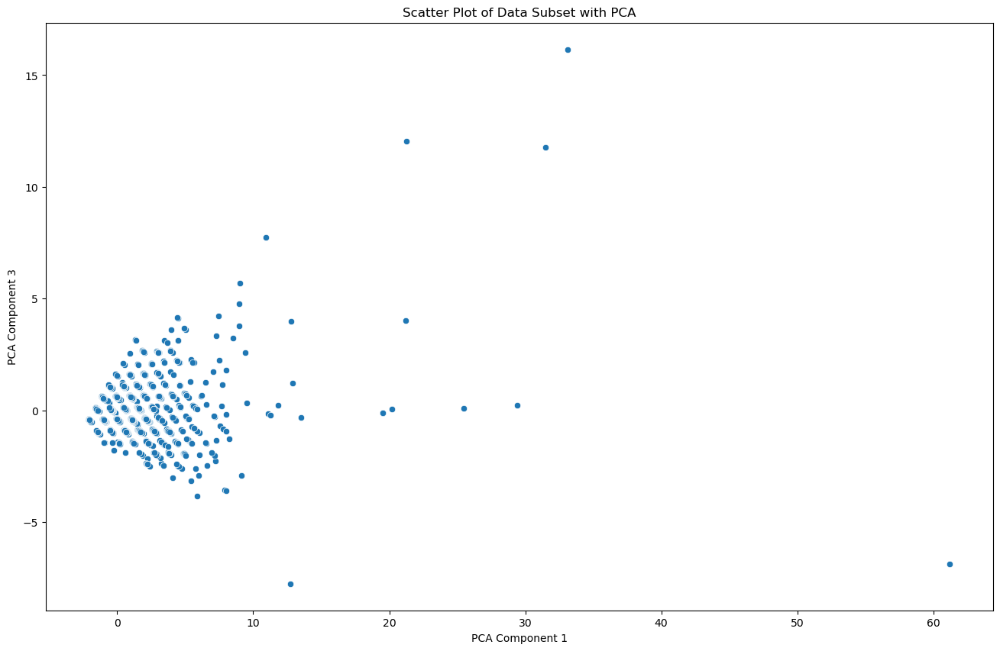
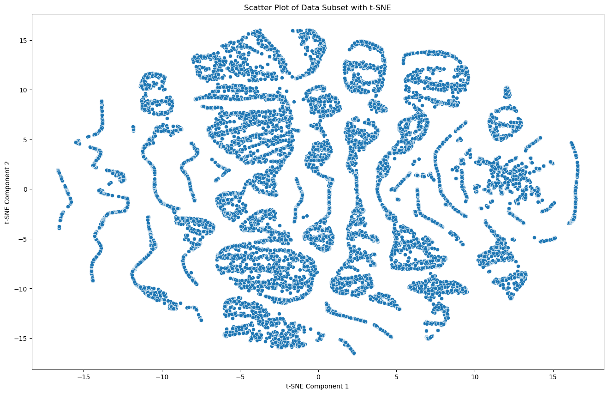
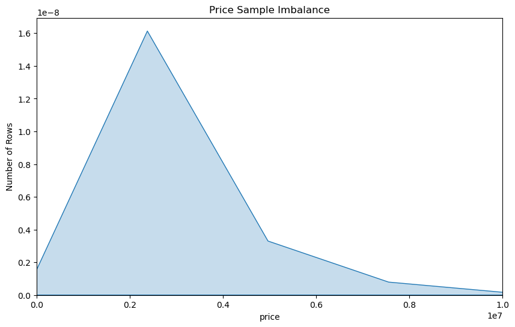

 **Project Submission Format** 
 
1. Python code with markdown documentation, images saved in .jpg or .png format, and README.md as a project report OR
2. Jupyter notebook (.ipynb) that contains full markdown sections as listed above 

# SUBMISSION FORMAT FOR THE REPORTS

#  Predicting Housing Prices
**Isaac Shepherd** 

## Project Summary

<Fully rewrite the summary as the last step for the *Project Submission* assignment: github.com repositories on how people shortblurb the project. It is a stand alone section. It is written to give the reader a summary of your work. Be sure to specific, yet brief.>

The purpose of the Predicting Housing Prices project is to develope a machine learning model that is capable of estimating the sale prices of houses based on various features such as location and size demographics. The main objective of this project is to train a predictive model based on real estate data, to accurately and effectively estimate the prices of future house listings. This experiment references an existing XGBoost model that has been proven effective on other housing price datasets. The purpose of this experiment is to tune the new dataset to the XGBoost model and using it as a baseline for testing different models for potentially stronger fits.

## Problem Statement 

<Add one sentence for the *Project Proposal* assignment submission that captures the project statement.>

The Predicting Housing Prices project aims to develope a machine learning model that can accurately estimate the sale prices of houses with regards to varying factors such as location and size, as to provide insight for future home buyers and sellers in making informed decisions.

<Expand the section with few sentences for the *Project Progress* assignment submission> 
* Give a clear and complete statement of the problem.
* What is the benchmark you are using.  Why?  
* Where does the data come from, what are its characteristics? Include informal success measures (e.g. accuracy on cross-validated data, without specifying ROC or precision/recall etc) that you planned to use. 
* What do you hope to achieve?>

The grand total of an estate's value is compiled with a multitude of factors centered around size, location, and ammenities. The problem I am solving is a way to estamate a median price point for a house in a multitude of locations, with a multitude of variation between house ammenities.

the benchmarks I am using to train my learning model are square footage, number of bedrooms and bathrooms, acre lot, and zip code location.

The data was retrieved from a recently updated kaggle library. the characteristics of the data are again, brokered_by, status, price, bed, bath, acre_lot, street, city, state, zip_code, house_size, and prev_sold_date. I plan to train the model to accurately predict the relative price of a house given the vital contributing factors data. I hope that my model is able to accurately fit the training data, and make predictions with a low margine of error.

<Finalize for the *Project Submission* assignment submission> 

## Dataset 

<Add highlights on the dataset, specifically the size in instances and attributes for **Project Proposal**>

My dataset from Zillow provides a Region Name, State, Metro, County Name, Size Rank, and the median housing price of each month from 1996 to 2016. Pruning the older data and the Nan values I will be able to train a predictive model that will account for regional variations and trends in the housing market over time.

[Download CSV File](./realtor-data.csv)

<Complete the following for the **Project Progress**>
* Description of the dataset (dimensions, names of variables with their description) If in doubt, use 3.1-3.3. [Datasheets For Datasets](https://arxiv.org/abs/1803.09010) as a guideline.  
* If you are using benchmarks, describe the data in details. If you are collecting data, describe why, how, data format, volume, labeling, etc.>

The dimensions of the raw data was 2226382 rows by 12 columns. After preprocessing the dataset is reduced to 1360627 by 6.
brokered_by = encoded value for agency the brokered the house
status = boolean value for sold or for_sale
price = float value used as the experiments target value
bed = integer attribute for number of bedrooms
bath = integer attribute for number of bathrooms
acre_lot = double value to indicate the squared area in acres the house resides
street = encoded value for street location
city = string value to label what city the house resides
state = string value to label what state the house resides
zip_code = numerical label for house location
house_size = float value to indicate square footage of the house
prev_sold_date = data value of when house was sold

<Expand and complete for *Project Submission*>

* What Processing Tools have you used.  Why?  Add final images from jupyter notebook. Use questions from 3.4 of the [Datasheets For Datasets](https://arxiv.org/abs/1803.09010) paper for a guide.> 

This experiment utilizes processing tools such as Scikit-learn for its machine learning library and evaluation functionality, XGBoost for its gradient boosting model, linear models from Scikit-learn, Matplotlib and Seaborn for general plotting of exploratory data analysis and model results, PCA and t-SNE from Scikit-learn for dimensionality reduction and exploratory data analysis, imbalance data handlers from Scikit-learn such as RandomOverSampler and SMOTE from Scikit-learn, and ensemble learning models such as random forest and gradient boosting from Scikit-learn.

## Exploratory Data Analysis 

<Complete for **Project Progress**>
* What EDA graphs you are planning to use? 
* Why? - Add figures if any

I have generated a pairplot to visualize relationships between variables, and several scatterplots for PCA and t-SNE to visualizes my preprocessed data in reduced dimensions. there were only 6 dimensions to my dataset, so the PCA did not provide any discernible insight on my dataset.

<Expand and complete for the **Project Submission**>
* Describe the methods you explored (usually algorithms, or data wrangling approaches). 
  * Include images. 
* Justify methods for feature normalization selection and the modeling approach you are planning to use. 

The first step of the experiment was analyzing the columns in the dataset and determining which columns were valuable to be included in the training set and which were not. This eliminated the columns containing string labels for location data and bool values for if the row was for sale or already sold.
The second step was to clean the truncated dataset by finding and eliminating all rows with NULL or Nan values using the prebuilt pandas methods. The dataset is then split between the target column 'price' and the rest of the remaining columns 'bed, bath, acre_lot, zip_code, and house_size' as subsets Y and X. 
The X subsets is then normalized using a standard scaler and then double checked for Nan values. 

## Data Preprocessing 

<Complete for *Project Progress*>
* Have you considered Dimensionality Reduction or Scaling? 
  * If yes, include steps here.  
* What did you consider but *not* use? Why? 

Dimensionality Reduction was considered in this experiment, however was not used in the data normalization as the dataset did not contain enough dimensions to make use of it. A Standard Scaler was utilized, but the PCA and t-SNE dimensionality reducing mechanisms were tested and unused in the model testing phase.

<Expand and complete for **Project Submission**>

## Machine Learning Approaches

<Complete for **Project Progress**>

* What is your baseline evaluation setup? Why? 
* Describe the ML methods that you consider using and what is the reason for their choice? 
   * What is the family of machine learning algorithms you are using and why?

The XGBoost model denoted by kaggle is a model that was effective on other housing datasets, and thus sets a baseline for improvement or what the experimental models should strive to achieve. So the first model test on this experiments dataset was the XGBoost which provided baseline scores on our dataset to improve upon, scoring similar to the gradient boosting model from scikit-learn at 0.4780 compared to 0.4791.
I then experimented with linear models such as linear regression, ridge regression, lasso, and polynomial at base 2, however these models performed the weakest compared to the ensemble models. The ensemble models that were tester were the random forest model and the gradient boosting model provided by scikit-learn. I did attempt using support vector machine regression, however it proved to be massively time consuming with the shape of the experiments dataset and had to be removed from the test runs. The ensemble learning models outperfomed the linear models as predicted, as ensemble learning models such as the random forest and gradient boosting  are built to handle non-linearity and multidimensionalism in vastly large datasets.

<Expand and complete for **Project Submission**>

* Describe the methods/datasets (you can have unscaled, selected, scaled version, multiple data farmes) that you ended up using for modeling. 

* Justify the selection of machine learning tools you have used
  * How they informed the next steps? 
* Make sure to include at least twp models: (1) baseline model, and (2) improvement model(s).  
   * The baseline model  is typically the simplest model that's applicable to that data problem, something we have learned in the class. 
   * Improvement model(s) are available on Kaggle challenge site, and you can research github.com and papers with code for approaches.  

I started with Normalized dataset for the first round of testing on each of the models, afterward I performed a seconds round of testing with a normalized and balanced dataset, utilizing the standard scaler provided by scikit-learn. 
during the first round of testing on the unbalanced dataset the random forest model outperfomed the XGBoost model, scoring a 0.5603 compared to the 0.4780 by XGBoost. in the following round the scores for all the models noticible decreased except for the random forest model. under the second the of testing the random forest model scored a 0.6112 compared to the 0.2703 by the XGBoost model. Another noticable fact was that although the gradient boosting model performed almost identically to the XGBoost model in the first round with unbalanced data, the gradient boosting model provided by scikit-learn's score only dropped 0.007, where as the XGBoost model's score decreased drastically by roughly 0.200.

## Experiments 

<**Project Submission** should only contain final version of the experiments. Please use visualizations whenever possible.>
* Describe how did you evaluate your solution 
  * What evaluation metrics did you use? 
* Describe a baseline model. 
  * How much did your model outperform the baseline?  
* Were there other models evaluated on the same dataset(s)? 
  * How did your model do in comparison to theirs? 
  * Show graphs/tables with results 
  * Present error analysis and suggestions for future improvement. 

I evaluated my soulution through a generic R^2 score and visual scatterplot comparing predicted values to actual target values for wach learning model under the conditions of normalized unbalanced data, and normalized balanced data.

the results are as follows:

**XGBoost model**

**Linear regression model**

**Ridge regression model**

**Lasso regression model**

**Polynomial regression model**

**Random forest model**

**Gradient boosting model**

## Conclusion
<Complete for the **Project Submission**>
* What did not work? 
* What do you think why? 
* What were approaches, tuning model parameters you have tried? 
* What features worked well and what didn't? 
* When describing methods that didn't work, make clear how they failed and any evaluation metrics you used to decide so. 
* How was that a data-driven decision? Be consise, all details can be left in .ipynb

 
## Submission Format
1. Python code with markdown documentation, images saved in .jpg or .png format, and README.md as a project report OR
2. Jupyter notebook (.ipynb) that contains full markdown sections as listed above 

## Now go back and write the summary at the top of the page
